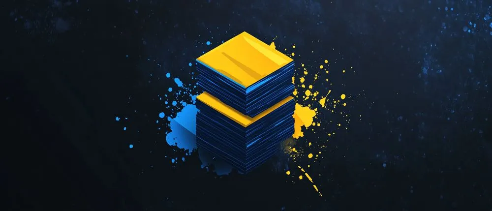

# image-manifest

[](https://www.npmjs.com/package/image-manifest)
[](https://github.com/vdistortion/image-manifest/actions/workflows/tests.yml)

A CLI tool to batch-convert and resize images (webp, avif, jpg, png) and generate a JSON manifest — for static sites and galleries.



## Quick Start

```sh
npx image-manifest@latest --json manifest
```

See the [full documentation](https://image-manifest.zvalentin.ru) for all options, interactive mode, configuration files, and programmatic API usage.

> ⭐ Like this tool? Give it a star on [GitHub](https://github.com/vdistortion/image-manifest) – it helps others discover the project!
